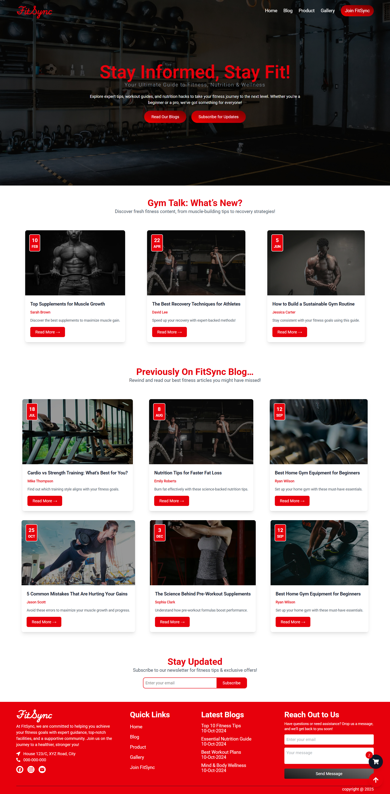
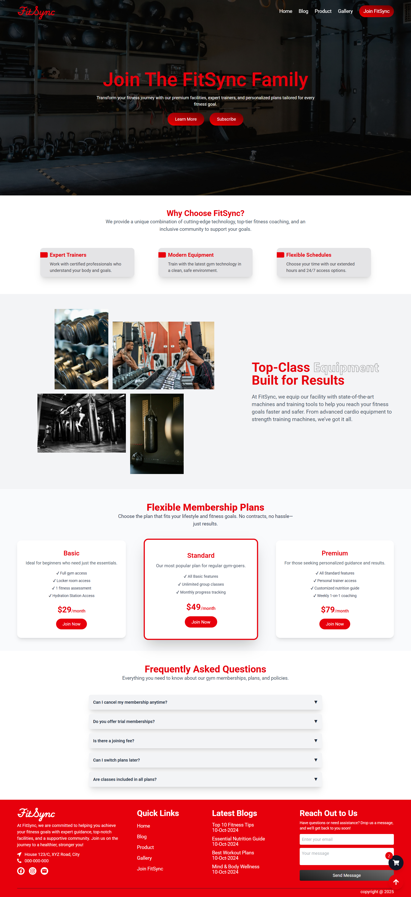

# FitSync – Modern Gym Website

**FitSync** is a sleek and responsive gym website built using **React**, **Vite**, and **Tailwind CSS**. It features five fully functional pages with smooth navigation, reusable components, responsive design, and a clean modern UI. The project is ideal for showcasing gym services, promoting fitness plans, displaying media, and collecting leads.

## 🧑‍💻 Live Preview

> [Check Live Demo](https://muhammadhussain29.github.io/FitSync/) 

---

## 🚀 Tech Stack

- [React](https://react.dev/)
- [Vite](https://vitejs.dev/)
- [Tailwind CSS](https://tailwindcss.com/)
- [React Router DOM](https://reactrouter.com/en/main)
- [React Icons](https://react-icons.github.io/react-icons)

## 🧩 Features

- 🔄 React Router DOM for SPA-style navigation
- 🎨 Tailwind CSS for modern and responsive styling
- 🔗 React Icons for intuitive iconography
- 🚀 Fast development with Vite
- 📱 Fully responsive on all screen sizes
- 🧱 Reusable and modular component structure
- 🌐 SEO-friendly and performance-optimized

## 📄 Pages

1. **Home** – Hero section, introduction to the gym, CTAs  
2. **Blog** – Fitness blogs, workout tips, gym updates  
3. **Product** – Membership plans, gym products, pricing  
4. **Gallery** – Image and video showcase of gym space  
5. **Join-us** – Contact form, location info, embedded map

## 📁 Folder Structure

```
FitSync/
├── public/
│   └── index.html
├── src/
│   ├── assets/
│   ├── components/
│   ├── pages/
│   │   ├── Home.jsx
│   │   ├── Blog.jsx
│   │   ├── Product.jsx
│   │   ├── Gallery.jsx
│   │   └── JoinUs.jsx
│   ├── App.jsx
│   ├── main.jsx
│   └── index.css
├── tailwind.config.js
├── postcss.config.js
├── package.json
└── vite.config.js
```

## 🛠️ Installation & Setup

1. **Clone the repo:**
   ```bash
   git clone https://github.com/muhammadhussain29/FitSync.git
   ```

2. **Install dependencies:**
   ```bash
   npm install
   ```

3. **Start development server:**
   ```bash
   npm run dev
   ```

4. **Build for production:**
   ```bash
   npm run build
   ```

## 🖼️ Screenshots

### Home Page


### Blog Page


### Gallery Page


### Product Page


### Join-us Page


## ✍️ Author

- **Muhammad Hussain Mughal**  
  [LinkedIn](https://www.linkedin.com/in/muhammad-hussain-mughal-213069248/)

## 📄 License

This project is licensed under the MIT License.
